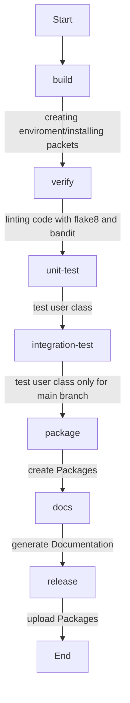

# MTM Group - CI/CD Pipeline Project

## Group Members
- Lorenzo Molinari
- Massimo Trippetta
- Lorenzo Megna

## Project Repositories
- [Repository 1](https://gitlab.com/gruppomtm/assignment1)
- [Repository 2](https://gitlab.com/gruppomtm2/2023_assignment1_MTM)

## Documentation
- [GitLab Pages (Generated Documentation)](https://gitlab.com/gruppomtm2/2023_assignment1_MTM/-/tree/main/site)

## Synopsis
The MTM Group's CI/CD Pipeline Project is a demonstration project developed for the Software Development Process course at the University of Milano-Bicocca. This project aims to showcase the implementation of a complete CI/CD (Continuous Integration and Continuous Deployment) pipeline and the tools involved.

## How it Works, Stages, and Jobs
In this project, we have created a comprehensive CI/CD pipeline that covers various key aspects.

Our CI/CD pipeline is divided into multiple stages, with each stage containing one or more parallel jobs. We have defined stages for building, verifying the code, running tests, creating packages, generating documentation, and releasing. Each job within a stage executes a specific set of tasks.

For detailed information on the stages and jobs, please refer to the comments in the `.gitlab-ci.yml` file in this repository.

## Decisions Made in the System
- The project uses MySQL as the database to store user data.
- The project uses Python as the programming language.
- The project uses flake8 and bandit for code linting (we did not use prospector "for pylint: astroid-error").
- The project uses pytest for unit and integration testing.
- The project uses wheel and twine for creating and distributing Python packages.

### MySQL Services
GitLab CI/CD allows us to use services to execute jobs. We have used MySQL services for running specific tasks that interact with a database.

### Code Structure
The project's code is contained in the `user.py` file. This file implements a simple access counter application that utilizes a MySQL database to track user data. Here's a brief explanation of the code structure:

- **db_password**: The MySQL database password is extracted from GitLab's CI/CD environment variables to ensure credential security.

- **User Class**: The `User` class represents the core application and contains the following methods:
  - `__init__`: This method initializes the MySQL database connection using the specified credentials.
  - `increment`: This method adds a record with the current timestamp to the `access_logs` table to track accesses.
  - `get_count`: This method retrieves the total count of accesses from the `access_logs` table.

### Pipeline Structure
The Continuous Integration and Continuous Deployment (CI/CD) pipeline is defined in the `.gitlab-ci.yml` file and is divided into several stages:

- **Build**: In this stage, we create a virtual environment, update pip, and install project dependencies, including tools such as flake8, bandit, pytest, wheel, mkdocs, and twine. This stage prepares the development environment.

- **Verify**: In this stage, we verify the source code using the flake8 and bandit tools for code linting.

- **Unit Test and Integration Test**: These stages run unit and integration tests, respectively. They use a MySQL service as part of the pipeline to test code that interacts with the database.

- **Package**: In this stage, we create packages of the project in various formats, including source and binary packages, ready for distribution.

- **Documentation**: This stage generates the project documentation using MkDocs and saves it as an artifact.

- **Release**: In the final stage, we release the project using credentials exported from a `.pypirc` configuration file and the Twine service.

### Caching
We have included a caching system in the pipeline. The virtual environment and other temporary files are cached between pipeline runs, reducing build and test times.

All environment variables, including the MySQL database password, are securely managed using GitLab's CI/CD environment variables.

## Variables
- `CI_COMMIT_REF_SLUG`: Identifies the Git repository branch from which the commit was made.
- `MYSQL_ROOT_PASSWORD`: The password for the MySQL database.
- `TWINE_USERNAME`: The username for the twine distribution service, in API case: __token__.
- `TWINE_PASSWORD`: The password for the twine distribution service, in API case: "password token".

## Useful Resources
- [MySQL Connector/Python Documentation](https://dev.mysql.com/doc/connector-python/en/)
- [flake8 Documentation](https://flake8.pycqa.org/en/latest/)
- [bandit Documentation](https://bandit.readthedocs.io/en/latest/)
- [pytest Documentation](https://docs.pytest.org/en/7.4.x/)
- [wheel Documentation](https://pypi.org/project/wheel/)
- [twine Documentation](https://twine.readthedocs.io/en/stable/)
